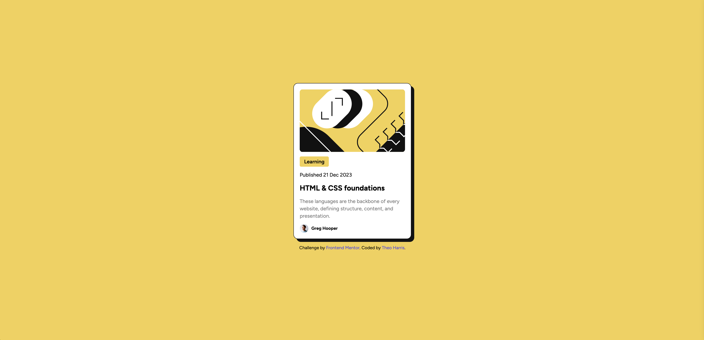

# Frontend Mentor - Blog preview card solution

This is a solution to the [Blog preview card challenge on Frontend Mentor](https://www.frontendmentor.io/challenges/blog-preview-card-ckPaj01IcS). Frontend Mentor challenges help you improve your coding skills by building realistic projects.

## Table of contents

- [Overview](#overview)
  - [The challenge](#the-challenge)
  - [Screenshot](#screenshot)
  - [Links](#links)
  - [Built with](#built-with)
- [Author](#author)

## Overview

### The challenge

Users should be able to:

- See hover and focus states for all interactive elements on the page

### Screenshot

### Links

- Solution URL: [Frontend Mentor](https://www.frontendmentor.io/solutions/blog-preview-card-html-tailwind-css-alpine-Wu6USCj94l)
- Live Site URL: [Github Pages](https://theosaurus-rex.github.io/frontend-mentor-blog-preview-card/)

### Built with

- Semantic HTML5 markup
- Tailwind CSS
- Alpine (for hover animations)

## Author

- Website - [Theo Harris](https://theo-harris-dev.com/)
- Frontend Mentor - [@Theosaurus-Rex](https://www.frontendmentor.io/profile/Theosaurus-Rex)
